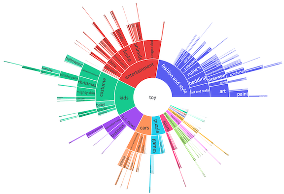

 # Hierarchical Tagger

 Making sense of the contents of a large set of unknown documents is relevant to many industry applications. This repository contains `hierarchical_tagger`, a module created to address this broad use case.

Combining the power of [Primer's Engines](https://developers.primer.ai/docs) with a custom proptype built on top of deep NLP models, the pipeline is designed to ingest an arbitrary set of documents, produce a hierarchical visualization of their contents, and finally make the corpus searchable by tagging each document with both specific and broad keywords.


### Installation

```
# Clone the repository
$ git clone https://github.com/PrimerAI/primer-hierarchical-tagger.git

# Move to repository root
$ cd hierarchical-tagger

# Create a virtual environment
$ mkvirtualenv ht-repo

# Install required packages
$ pip install --upgrade pip
$ pip install -r requirements.txt
```

### Resources

Checkout these resources to know more about the project:

- [Generating data-driven topic hierarchies from text using deep NLP models](https://primer.ai/blog/generating-data-driven-topic-hierarchies-from-text-using-deep-nlp-models/), a Primer AI Blog post discussing the methodological internals of the module.

- [Using Primer Engines and NLP to get a big-picture view across documents](https://primer.ai/blog/using-primer-engines-and-nlp-to-get-a-big-picture-view-across-documents/), a Primer AI Blog tutorial going through module workflow end-to-end.

- [Module Documentation](./hierarchical_tagger/hierarchical_tagger.py#L33) in the HierarchicalTagger class docstring.
<<<<<<< HEAD

The module and code are released in the hope that these may be useful for users and to promote an understanding of the products offered by Primer AI. While Primer AI may release further enhancements to this work, it does not commit to maintaining this project in any way.

 ### Licence

 The module is covered by the GNU Lesser General Public License v3.0

Permissions of this copyleft license are conditioned on making available complete source code of licensed works and modifications under the same license or the GNU GPLv3. Copyright and license notices must be preserved. Contributors provide an express grant of patent rights. However, a larger work using the licensed work through interfaces provided by the licensed work may be distributed under different terms and without source code for the larger work.

See the [LICENCE](LICENCE) document for full details.
=======
 
The module and code are released in the hope that these may be useful for users and to promote an understanding of the products offered by Primer AI. While Primer AI may release further enhancements to this work, it does not commit to maintaining this project in any way. 
 
 ### License
 
 The module is covered by the GNU Lesser General Public License v3.0

Permissions of this copyleft license are conditioned on making available complete source code of licensed works and modifications under the same license or the GNU GPLv3. Copyright and license notices must be preserved. Contributors provide an express grant of patent rights. However, a larger work using the licensed work through interfaces provided by the licensed work may be distributed under different terms and without source code for the larger work.
 
See the [LICENSE](LICENSE) document for full details. 
>>>>>>> cc7e145f3f20cb96faf9a8bd745140395bd45def

